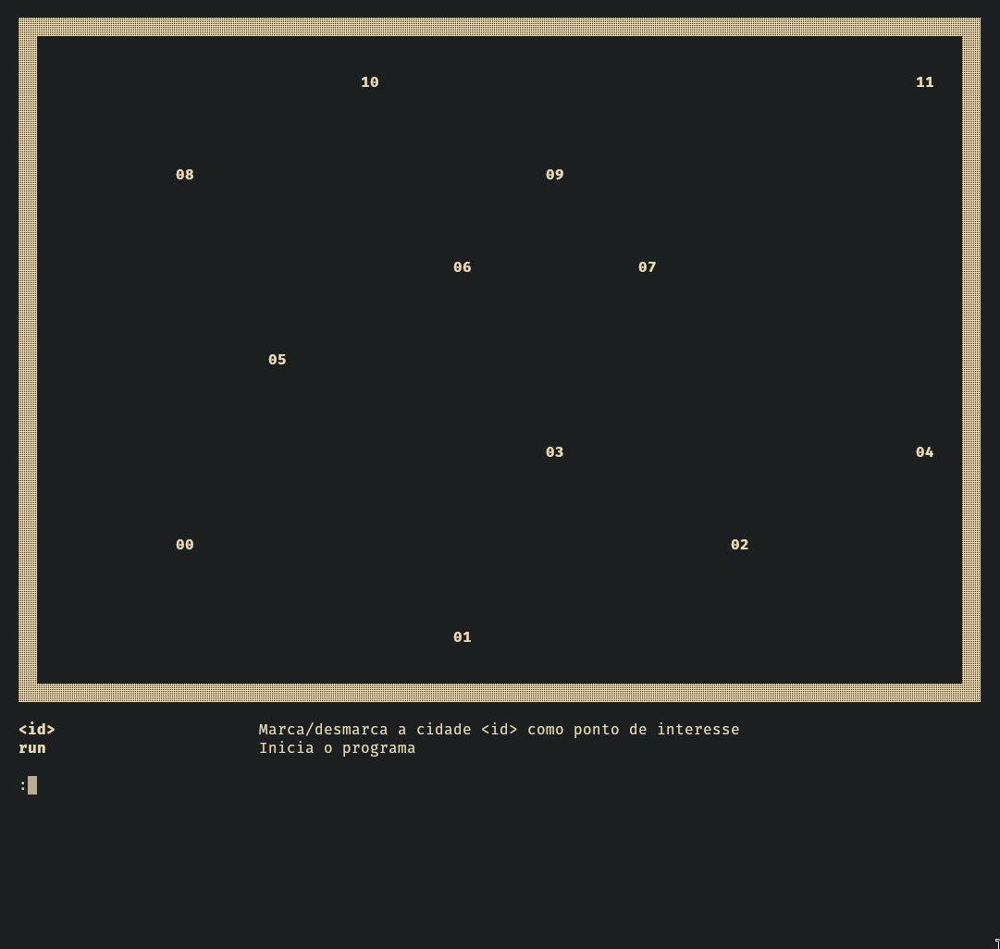
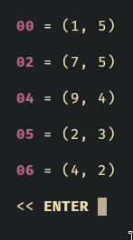
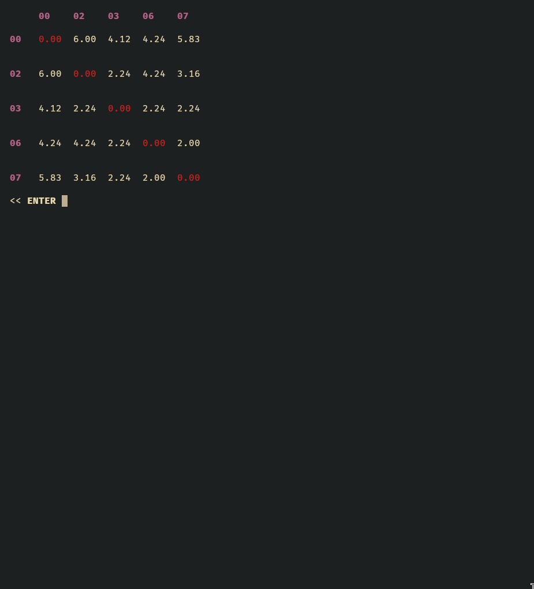
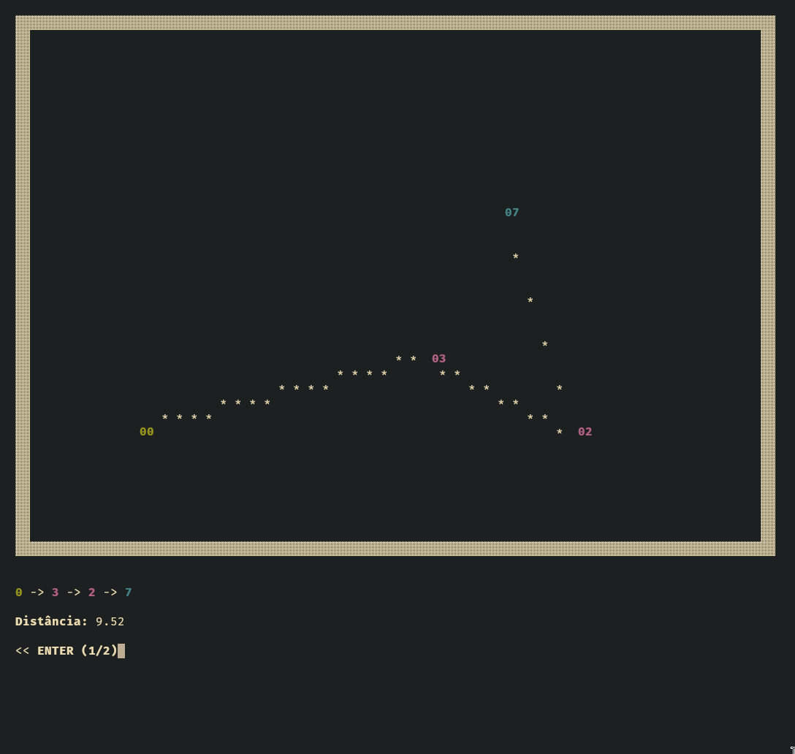
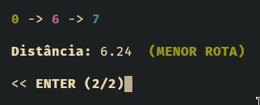
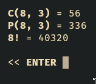

# Path-Finder

Por: **Alan Vale**

Um programa **C** que gerencia rotas entre cidades usando conceitos de grafos e matemática discreta.  

- **IMPORTANTE** - Esse programa foi feito usando interface no terminal, então caso a janela do terminal esteja muito pequena, a visualização pode quebrar. Além disso, o programa foi feito pra terminais com suporte **ANSI**, mas tem uma flag de compilação que desativa os caracteres ANSI, descrita na seção "Como rodar"

Recomendo que leia esse `readme.md` pelo github pra ter o documento formatado, basta seguir esse link:  
https://github.com/alaanvv/Path-Finder

## Demo

Gravei uma demonstração do programa, acabei me esquecendo de usar o comando `dist`, mas ele está demonstrado mais pra frente nesse arquivo.
> Clique pra assistir ou assista nos arquivos do projeto `(demo/demo.mp4)`

[](https://www.youtube.com/watch?v=w0RIthyf9lQ)

## Como rodar

> Os executáveis já estão disponíveis nos arquivos, então o passo de compilar é opcional


### Linux

1. Compile
`gcc src/main.c -o pathfinder-linux -lm`

2. Execute
`./pathfinder-linux`

### Windows

1. Compile  
`gcc src/main.c -o pathfinder-windows.exe -lm`

2. Execute  
`pathfinder-windows.exe`

---

Existem duas flags especiais pra compilação

- `-DSAFE_CHARS` - Use essa flag se quiser usar caracteres mais suportados, evitando quebrar em terminais mais limitados
- `-DNO_ANSI` - Use essa flag se seu terminal não tiver suporte pra ANSI, assim o programa fica sem cores e limpeza de tela

> Exemplo de como usar as flags:  
`gcc src/main.c -o pathfinder-linux -lm -DSAFE_CHARS -DNO_ANSI`

## Como usar

Rode o programa a partir de uma pasta contendo `instancia.txt`  
A primeira linha desse arquivo deve conter a quantidade de pontos descrito nele, e as próximas são pares de inteiros descrevendo o **x** e **y** dos pontos. Ex:  

```
12
1 5
4 6
7 5
5 4
9 4
2 3
4 2
6 2
1 1
5 1
3 0
9 0
```

A primeira parte do programa é a seleção dos pontos de interesse, onde o usuário escolhe a partir dos pontos lidos do arquivo quais ele vai querer usar no programa.



Basta digitar o número do ponto e apertar **ENTER** pra marcá-lo  
Se o ponto já estiver marcado, ele desmarca.  

> Os pontos marcados ficam destacados na visualização.


Após selecionar os pontos de interesse desejados, use o comando `run` pra iniciar o gerenciamento de rotas.  


Nessa tela, apenas os pontos de interesse são mostrados, e temos acesso aos comandos do programa.  

## Comandos

- `coords` - Mostra as coordenadas de cada ponto  
Após ver as coordenadas, aperte **ENTER** pra sair.




- `dist` - Calcula matriz de distâncias  
Após ver a matriz, aperte **ENTER** pra sair.



---

- `conn <id1> <id2>` - Conecta/desconecta dois pontos  
Digite `conn` e o índice dos pontos que você quer conectar.  
Se você digitar o índice de pontos já conectados eles se desconectam.  
Pontos conectados são mostrados com uma linha entre eles.


---

- `routes <id1> <id2>` - Calcula todas rotas entre duas cidades  
Digite `routes` e o índice dos pontos que você quer ver as rotas.  
Isso vai mostrar todas as rotas possíveis.  
Pra cada rota, será mostrada a distância total e a quantidade possível de permutações dos pontos intermediários.  
Aperte **ENTER** pra passar pra próxima.



Quando uma rota for a menor possível, será mostrado uma mensagem na frente da distância total.  



---

- `count <n> <r>` - Calcula combinações e permutações  
Digite `count` seguido dos valores `n` e `r`.
Mostra:
  - nPr (permutações de n tomados r)
  - nCr (combinações de n tomados r)
  - n!  (fatorial de n)
Pra sair da tela, aperte **ENTER**.



---

- `exit` - Encerra o programa  
Fecha o programa
